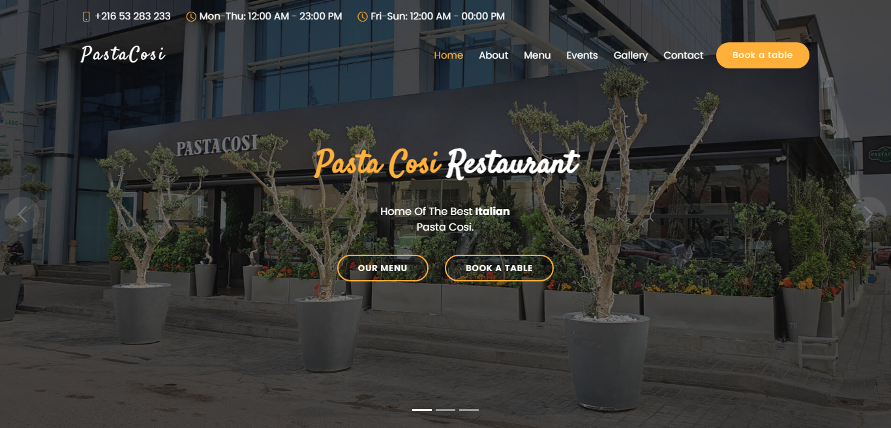

[Pastacosi Restaurant](https://pastacosi.netlify.app) is a simple, modern and responsive website for restaurants, made with Bootstrap.

# Live Preview:

Link: https://rahul754922.github.io/Pasta-Cosi-Restaurant/

# Install

- Clone the repository:

```bash
git clone https://github.com/rahul754922/Pasta-Cosi-Restaurant
```

- Open **`index.html`** in your browser, and enjoy !

# Used libraries

- JavaScript
- CSS
- Bootstrap5
- Bootstrap-icons
- Swiper
- Isotope
- Animate.css

## Todos

- [ ] Implement back-end project for food ordering, delivery, and booking tables.
